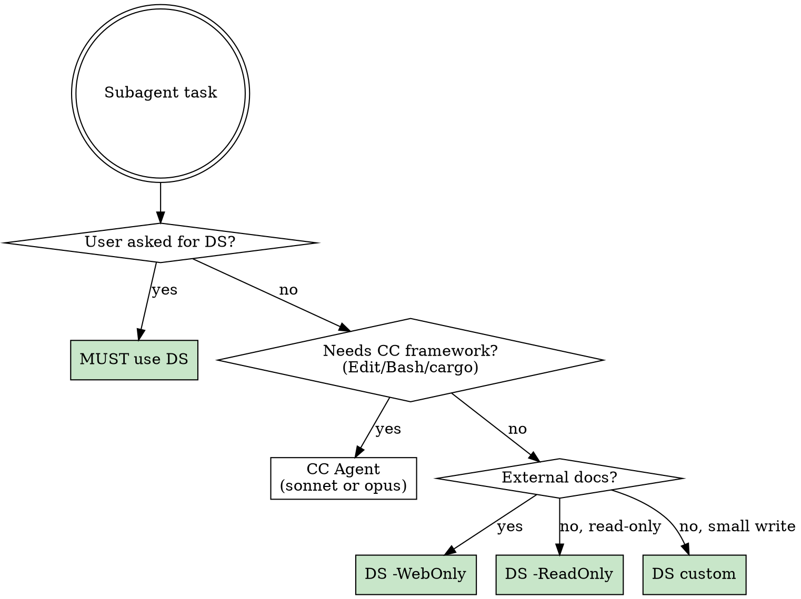

# DeepSeek Agent Dispatch

DS V4 Pro: 1M context, 15-20x cheaper than CC Agent. Ideal for read-only research where session context is unnecessary.

## Routing Flowchart



> **Haiku 已废弃。** DS V4 Flash 参数量远大于 Haiku，通用任务严格更强。不要用 `model=haiku` 派发 CC Agent。

## Mode Reference

| Mode | Flag | When |
|------|------|------|
| Web | `-WebOnly` | External API docs, library changelogs, ecosystem survey |
| Read-only | `-ReadOnly` | Code audit, pub API inventory, cross-file info gathering |
| Custom | `-AllowedTools "Read,Grep,Glob,Edit"` | Small-scope code edits with precise tool limits |
| Full | (no flag) | Requires Opus review after |

## Invocation

```powershell
$raw = powershell -File .claude/ds-claude.ps1 -Prompt @'
<task description>

不要猜测，只报告你在文件中看到的内容。如果找不到就说找不到。
'@ -ReadOnly
$result = ($raw | ConvertFrom-Json).result
```

**Anti-hallucination suffix (REQUIRED for `-ReadOnly`):** Always append `不要猜测，只报告你在文件中看到的内容。如果找不到就说找不到。` to code-reading prompts.

**Parallel dispatch:** DS runs as isolated processes — safe to `Start-Job` multiple calls.

## Timeout Policy

**NEVER set a timeout on DS PowerShell calls.** DS V4 Pro processes large codebases (1M context) and may take 10-20+ minutes for thorough audits. Setting a timeout causes premature termination and wastes the entire API call cost.

- Do NOT pass `-timeout` to the PowerShell tool when invoking ds-claude.ps1
- If you must set a timeout, use **minimum 1200000ms (20 minutes)**
- Default PowerShell 2-minute timeout is insufficient — always override with `timeout: 1200000` or omit entirely

## Liveness Check

DS API calls can hang indefinitely. **Every 10 minutes**, check each running DS agent's liveness:

```powershell
# Check output file tail — if unchanged since last check, the process is likely hung
Get-Content "<output_file>" -Tail 3
# Check if the spawned powershell process is still alive
Get-Process powershell -ErrorAction SilentlyContinue | Where-Object { $_.Id -ne $PID } | Select-Object Id, StartTime, @{N='RunMin';E={[math]::Round(((Get-Date) - $_.StartTime).TotalMinutes, 1)}}
```

**Decision logic:**
1. If output file has new content since last check → alive, keep waiting
2. If output file unchanged AND process running > 20 min → likely hung, kill process and re-dispatch
3. If process no longer exists but no completion notification → crashed, re-dispatch
4. If output file has final JSON result → completed, read result

**Kill a hung DS process:**
```powershell
Stop-Process -Id <PID> -Force
```

**IMPORTANT:** Track the dispatch timestamp for each DS agent. Set a reminder or check proactively — do not rely solely on background task notifications, as a hung API call will never produce one.

## Red Flags — You're Avoiding DS

- Dispatching Explore for pure information gathering with no write need
- Doing 3+ WebSearches for external documentation in sequence
- User said "DS" or "DeepSeek" → MUST comply, not substitute with CC
- Code audit across multiple crates → DS -ReadOnly excels here
- About to use `model=haiku` for any CC Agent → use DS instead, haiku 已废弃
- Rationalizing "needs session context" → can you summarize in 2 sentences? Then DS is fine

## Review Pipeline (writes only)

1. DS `-ReadOnly` executes → attempted writes appear in `permission_denials`
2. Extract code from `permission_denials[].tool_input.content`
3. Review correctness, then write via CC
