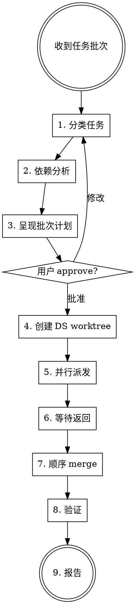

# Parallel Dispatch Orchestrator

你是 orchestrator。用户给你一批任务，你分类、并行派发、合并结果。

## 触发条件

用户说类似："执行 Iteration 1"、"并行跑 A1 A2 C1"、"把这三个任务并行做了"。

## 工作流



## Step 1: 分类任务

每个任务分配到 Claude 或 DS：

**→ Claude Agent（语义/判断密集型）：**
- 类型推断逻辑修改
- 需要设计决策的新特性
- 核心数据结构变更
- 新语义规则

**→ DS Worker（机械/模式固定型）：**
- 代码搬移、文件拆分
- Accessor 统一、代码去重
- 模式固定的 parser/codegen 扩展（参照已有 case）
- Boilerplate 消除

**判断困难时**：默认 Claude。DS 失败了要重跑，Claude 贵但成功率高。

## Step 2: 依赖分析

检查任务间是否有文件级冲突：
- 两个任务修改同一文件的同一区域 → **不可并行**，排入同一 worker 或定先后顺序
- 两个任务修改同一文件的不同区域 → **可并行**，但注意 merge 顺序
- 两个任务修改不同文件 → **安全并行**

输出 merge 顺序建议：机械重构先 merge（改动面广但逻辑简单），语义变更后 merge（改动小但逻辑关键）。

## Step 3: 呈现批次计划

向用户展示一个表格，格式：

```markdown
## Iteration N 批次计划

| 任务 | 类型 | Worker | 关键文件 | 冲突风险 |
|------|------|--------|---------|---------|
| A1   | 语义 | Claude | infer.ring | 与 C1 低冲突 |
| A2   | 语法 | DS     | parser.ring, codegen.ring | 无 |
| C1   | 机械 | DS     | 多文件 accessor | 与 A1 低冲突 |

**Merge 顺序**：C1 → A2 → A1
**预计并行时间**：~30min（最慢 worker 决定）
```

等用户一次性 approve。**不逐项审批。**

## Step 4: 为 DS Worker 创建 Worktree

Claude Worker 的 worktree 由 `Agent(isolation: "worktree")` 自动管理，不需要手动创建。

仅为 DS Worker 创建：

```powershell
# 为每个 DS 任务创建 worktree
git worktree add ../ring-wt-<task-id> -b task/<task-id>
```

记录创建的 worktree 路径和 branch 名，后续 merge 和清理用。

## Step 5: 并行派发

**关键：在同一条消息中发出所有 Agent/PowerShell 调用，让它们并发执行。**

### Claude Worker 派发

使用 Agent 工具，每个任务一个调用：

```
Agent({
  description: "Ring task <task-id>",
  isolation: "worktree",
  prompt: "<见下方 Claude Worker Prompt 模板>"
})
```

### DS Worker 派发

使用 PowerShell 工具调用 deepseek exec，每个任务一个调用：

```powershell
# run_in_background: true, timeout: 600000
cd ../ring-wt-<task-id>
deepseek exec --auto --json --yolo --model deepseek-v4-pro -p @'
<见下方 DS Worker Prompt 模板>
'@ 2>&1 | Out-File -Encoding utf8 "../ds-result-<task-id>.json"
```

注意：
- DS 用 `--yolo` 模式（需要写文件）
- `run_in_background: true`，不设短 timeout
- 输出文件放在 worktree 外面，避免被 git 跟踪

### 并发限制

- Claude Workers: 最多 3 个（orchestrator 占 1 slot，总共 4-5）
- DS Workers: 最多 3 个（DS API 并发限制）
- 超出限制的任务排队，第一批完成后派发第二批

## Step 6: 等待返回

- Claude Agent: Agent 工具会自动等待返回
- DS Worker: `run_in_background` 完成后会收到通知，读取 `ds-result-<task-id>.json`

检查每个 worker 的返回状态：
- 成功：有 commit，测试通过
- 失败：无 commit 或测试未通过 → 记录失败原因，继续处理其他 worker

## Step 7: 顺序 Merge

按 Step 2 确定的顺序逐个 merge：

```powershell
# 对于 Claude Worker（Agent 返回 branch 名）
git merge task/<task-id> --no-edit

# 对于 DS Worker（手动管理的 worktree）
git merge task/<task-id> --no-edit
```

每 merge 一个，立即跑快速验证（编译通过即可，不用跑全量测试）：

```powershell
node dist/ring.js self-compile
```

如果 merge 冲突：
1. 尝试 rebase：`git rebase main task/<task-id>` 然后重试 merge
2. Rebase 也失败 → **跳过该任务**，记录冲突详情，继续 merge 其他任务

## Step 8: 全量验证

所有成功 merge 的任务合并完成后：

```powershell
node dist/ring.js self-compile
node dist/ring.js test
```

如果失败：二分定位是哪个 merge 引入的问题。Revert 有问题的 merge，将该任务标记为失败。

## Step 9: 报告

```markdown
## Iteration N 执行结果

| 任务 | Worker | 状态 | 备注 |
|------|--------|------|------|
| C1   | DS     | ✅ 成功 | merged, 12 files changed |
| A2   | DS     | ✅ 成功 | merged, 3 files changed |
| A1   | Claude | ❌ 冲突 | merge conflict in infer.ring L234-250 |

**测试**：self-compile ✅ | E2E 320/324 ✅（+2 from baseline 318/324）

**待处理**：A1 需要在 C1 基础上手动重新实现
```

## 清理

```powershell
# 清理所有 worktree 和临时 branch
git worktree list  # 确认有哪些
git worktree remove ../ring-wt-<task-id>  # 逐个删除
git branch -d task/<task-id>              # 删除已 merge 的 branch
git branch -D task/<task-id>              # 删除未 merge 的 branch（失败的任务）
Remove-Item ../ds-result-*.json           # 清理 DS 输出文件
```

---

## Worker Prompt 模板

### Claude Worker Prompt

```
你是 Ring-lang 编译器的实现 agent。以下是已批准的任务 spec，直接实现。

## 约束
- 这个任务已经过审批。不要调用 brainstorming、writing-plans 或任何 plan 审批流程。直接写代码。
- 完成后运行 `node dist/ring.js self-compile` 和 `node dist/ring.js test` 确认通过
- 测试不过不要 commit，在返回消息中报告失败原因
- 只修改 spec 范围内的文件，不要做额外重构
- Commit message 格式：`feat(<scope>): <简述>` 或 `refactor(<scope>): <简述>`

## 任务
<TASK_SPEC>

## 关键文件
<FILE_LIST>
- path/to/file.ring — 这个文件做什么、要改什么

## 项目上下文
- Ring-lang 是自举的编译器（Ring 写 Ring），产出 JavaScript
- 入口：`node dist/ring.js <command>`
- self-compile：`node dist/ring.js self-compile`（编译自身到 dist/）
- 测试：`node dist/ring.js test`（运行 tests/ 下的 .ring E2E 测试）
- 当前 318/324 E2E 测试通过
```

### DS Worker Prompt

```
你是代码重构 agent。在当前目录下执行以下已批准的重构任务。

## 约束
- 只修改指定的文件，不要动其他文件
- 完成后运行 `node dist/ring.js self-compile` 确认编译通过
- 如果编译失败，回滚修改并报告原因
- 不要猜测，只基于你在文件中看到的内容做修改

## 任务
<TASK_SPEC>

## 变更规则
<EXPLICIT_TRANSFORMATION_RULES>
例如：
- 将所有 `expr_type(e)` 调用替换为 `e.type`
- 仅在以下文件中执行：checker.ring, codegen.ring, infer.ring
- 不要修改函数签名，只改调用方式

## 验证
修改完成后执行：
```shell
node dist/ring.js self-compile
```
如果失败，回滚所有修改并在回复中说明失败原因。
```

**DS prompt 注意事项：**
- 必须包含具体的变换规则（输入 → 输出），不能只说"统一 accessor"
- 贴上相关源码片段让 DS 理解上下文，不要假设 DS 了解 Ring 语法
- 限制变更范围到具体文件列表

---

## 失败重试策略

| 失败类型 | 处理 |
|---------|------|
| DS 测试不过 | 回滚 DS worktree，重新派发给 Claude Worker |
| Claude 测试不过 | 返回失败报告，由 orchestrator 诊断或交给用户 |
| Merge 冲突 | 尝试 rebase，失败则跳过，报告用户 |
| Self-compile 失败（merge 后） | 二分 revert，定位问题 branch |
| Worker 超时（>30min） | 终止，标记失败，考虑拆分为更小任务 |

DS 任务失败 → 自动升级为 Claude 任务重试（最多 1 次）。
Claude 任务失败 → 不自动重试，报告用户决定。

---

## 注意事项

- **不要串行派发**。所有 worker 必须在同一条消息中的多个工具调用中并行发出。
- **Orchestrator 不实现任务**。你的职责是调度和合并，不是自己写代码。
- **每个 iteration 一次 approve**。不要逐个任务找用户确认。
- **Worker 不走 superpowers 流程**。已在 prompt 模板中明确指示跳过。
- **Merge 顺序很重要**。机械重构先，语义变更后。先 merge 的 branch 是 base，后 merge 的在其上 rebase。
